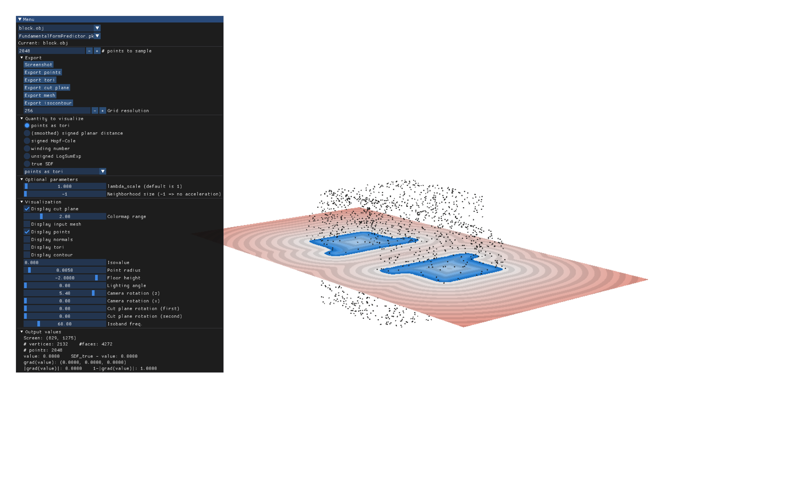
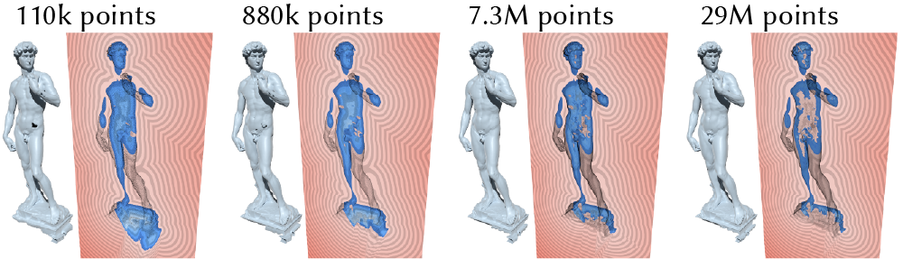

# Points as Tori

This repo implements _Points as Tori (PAT)_ for estimating signed distance from oriented point clouds. PAT computes signed distance directly from point clouds, and allows fast pointwise evaluation of signed distance at arbitrary spatial resolution --- without requiring discretization, global optimization, or explicit reconstruction.

PAT was introduced in the SIGGRAPH 2026 paper "[Points as Tori: Fast Pointwise Signed Distance for Point Clouds](https://nzfeng.github.io/research/SignedHeatMethod/index.html)" by [Nicole Feng](https://nzfeng.github.io/index.html), [Ioannis Gkioulekas](https://www.cs.cmu.edu/~igkioule/), [Keenan Crane](https://www.cs.cmu.edu/~kmcrane/).


Paper PDF (28.4mb): [link](https://nzfeng.github.io/research/PointsAsTori/PointsAsTori.pdf)

Project page with paper, videos, and blog-style explanations: [link](https://nzfeng.github.io/research/PointsAsTori/index.html)

**There's room for contribution**; see "[Areas of improvement](#areas-of-improvement)" and "[Repository TODOs](#repository-todos)". These sections are also good for getting an idea of the limitations of this method. If you have a feature or improvement in mind, or if parts of the repository buggy or poorly explained, leave an issue and/or PR on GitHub.

## Usage for signed distance

If building this project from source, it is likely that you may have to first initialize git submodules after cloning the repository, using 

```
git submodule update --init --recursive
```

This project relies on C++ extensions. Build the Python package using 

```
pip install .
```

at the top level of the repo. Releasing a Python package that one can pip-install from PyPI is a TODO.


The API is implemented in `infer.py`. Usage:

```
pat = PointsAsTori(points, normals, tori=None, tori_filepath=None) # optional arguments to other tori, or load from file

# `queries` is a (n_queries, 3) NumPy array containing query positions
distances = pat.signed_distance(queries)   # returns a (n_queries, ) NumPy array
gradients = pat.sdf_gradient(queries)      # returns a (n_queries, 3) NumPy array
```

In more detail: for a given point cloud, tori are first fit to the point cloud using a small pre-trained neural network (included in the repo); tori data needs to be precomputed only once per point cloud, and is stored in the `PointsAsTori` as object. Optionally, a `PointsAsTori` object can be initialized with existing pre-computed tori.

To give an idea of precomputation time: Using an NVIDIA RTX 3090, precomputation takes <10 seconds for 100k points, <60s for 1M points, 1-4 minutes for 5-10M points, and >10 minutes for 20M+ points (time scales linearly with point cloud size). A Macbook Pro laptop with an M3 Max chip, 16-core CPU, and 64 GB of RAM, takes about a minute for 50k points, eight minutes for 1M points.

## Demo & shader visualization



First follow the set up instructions in the [above section](#usage-for-signed-distance).

For now, I've included a shader visualization that uses `pyglet` and `pyimgui`. These dependences admittedly can be a pain to set up, and developing an easier-to-use browser-based shader is a TODO. _Contributions welcome!_

The demo uses additional dependencies that require a version of Python between 3.9 - 3.11. You can change Python versions easily by setting up a virtual environment. For example, you can create a new existing Python virtual environment using `venv` (using Python version 3.11 here as an example) with
```
python3.11 -m venv [venv name]
```
and activate an existing Python virtual environment using
```
source [venv name]/bin/activate
```
To deactivate an activated Python virtual environment, use
```
deactivate
```
And to delete a Python virtual environment, use
```
rm -r [venv name]
```

Alternatively, you can use `pyenv`:
```
pyenv install 3.11
```
To create a virtual environment using pyenv, use `pyenv virtualenv 3.11 [venv name]`; to activate, use `pyenv activate [venv name]`; to deactivate, use `pyenv deactivate`; to delete, use `pyenv uninstall [venv name]`.

The demo requires additional dependencies that can be pip-installed as follows:

```
pip install pyglet "imgui[pyglet] pyvista"
```

Run the demo from the `/demo` directory using 

```
python demo_3d.py
```

GUI interactions:
* mouse scroll: zoom in/out
* mouse click-and-drag: pan
* left-right mouse motion: move cutplane along axis
* tab: switch axis of cutplane
* spacebar: freeze the cutplane at its current location

## Dependencies

Python bindings are implemented using [`nanobind`](https://github.com/wjakob/nanobind). [`nanoflann`](https://github.com/jlblancoc/nanoflann) is used to build KD-trees to accelerate signed distance queries. The C++ functions use OpenMP for parallelization. All dependencies are included as submodules.

This project additionally contains submodule dependences on [`libigl`](https://libigl.github.io/) and [`fcpw`](https://github.com/rohan-sawhney/fcpw) for their routines for winding numbers and exact distance, respectively. These are not strictly required, but they may be interesting to users as a point of comparison.

## Training

The `training/` directory contains scripts for training the neural network component and pre-processing training data. Pre-generated training data can be found at [this Google drive directory](https://drive.google.com/drive/folders/1hnG-1OCwZ0SWS47Kgmk4chPG825AOfGt?usp=sharing) (total size 6.2 GB).

The training scripts use additional Python packages, which can be pip-installed:

```
pip install scipy numpy-stl matplotlib thingi10k py7zr pyvista trimesh pyfqmr noise
```

## Areas of improvement

Areas of improvement mostly center around neural network performance and robustness.

1. *Precomputation cost:* On the one hand, training/inference of our neural network is at least an order of magnitude faster than many end-to-end neural methods (e.g. neural field fitting), and each signed distance query takes 10^{-4} - 10^{-3} seconds. Still, the precomputation cost of fitting tori to a new point cloud is not yet "instant"; using an NVIDIA RTX 3090, precomputation takes <10 seconds for 100k points, <60s for 1M points, 1-4 minutes for 5-10M points, and >10 minutes for 20M+ points (time scales linearly with point cloud size). (A Macbook Pro laptop with an M3 Max chip, 16-core CPU, and 64 GB of RAM, takes about a minute for 50k points, eight minutes for 1M points.)

    The neural network has not been extensively engineered; I suspect that performance may be significantly improved with better choice or normalization of input features, fewer attention layers, or perhaps a different architecture entirely.

    Previously, I experimented with classic point set approaches for torus fitting that proved inadequate --- hence why I decided to use a small neural network. But it may still be possible to develop an effective non-neural approach to fitting tori that bypasses the need for a neural network entirely. Experimentation and suggestions welcome!

<!-- If used for optimization tasks, tori can perhaps be updated using simple gradient-based updates rather than forward passes of the neural network.  -->

2. *Robustness to corruption and out-of-distribution behavior:* The network's current predictions may not generalize to point clouds whose sampling characteristics are significantly different from those seen in training, such as point clouds with significantly different sampling density, or significant amounts of noise, outliers, flipped normals, or missing data (see figure below). It may be worthwhile to train on more diverse data --- I only trained on clean point clouds with 2048 points each. To improve accuracy, it may also be useful to include some form of neighborhood size estimation or adopt a hierarchical approach, or simply preprocess input point clouds (e.g. subsample to match a target density, noise/outlier removal). Another recommendation is to specifically train the neural component on point clouds whose sampling characteristics resemble the expected distribution --- for that reason, I've provided training scripts (see ["Training"](#training)).

<p align="center">

<figcaption styles="text-align: center; width: 60%"><i>Visualization of an SDF slice resulting from increasingly dense samplings of the same shape. Even though the point clouds aren't noisy, the SDF becomes increasingly worse (especially in the interior) because the sampling density deviates so much from that seen in training. See the above paragraph for possible remedies.</i></figcaption>
</p>

## Repository TODOs (contributions welcome!)

* Implement the Laplacian of the SDF of a torus in the C++ function `TorusDistanceField::evaluate_distance_gradient_laplacian_single()`
* Implement browser-based shader using WebGL or WebGPU
* More efficient sphere tracing
* Release Python package on PyPI (and thus implement basic CI/CD)

## Citation

If this code contributes to academic work, cite it as:
```bibtex
@article{Feng:2026:PAT,
    author = {Feng, Nicole and Gkioulekas, Ioannis and Crane, Keenan},
    title = {Points as Tori: Fast Pointwise Signed Distance for Point Clouds},
    year = {2026},
    issue_date = {August 2026},
    publisher = {Association for Computing Machinery},
    address = {New York, NY, USA},
    volume = {45},
    number = {4},
    issn = {0730-0301},
    url = {https://doi.org/10.1145/3811385},
    doi = {10.1145/3811385},
    journal = {ACM Trans. Graph.},
    month = {jul},
    articleno = {53},
    numpages = {24}
}
```
